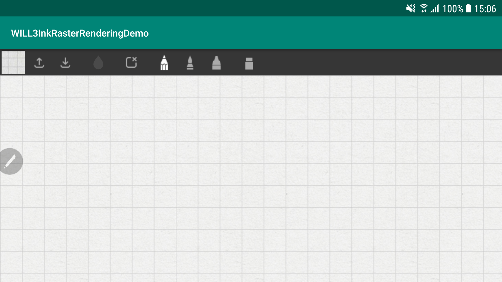

# WILL SDK for ink (v3.0) - Android Raster rendering demo


## Description
The purpose of this sample tutorial is to demonstrate how to use WILL SDK for ink (v3.0) to create raster-based ink strokes in Android applications.

### Key Features
- Particle brushes with custom brush texture
- Configurable pipeline for transforming pointer input to ink geometry
- Support for pointer pressure, tilt and velocity
- Smoothing of input values
- Variable color/transparency for particle brushes


# Getting Started
## Development Environment
- Android Studio 3.4. 
- The WILL SDK for Ink (v3.0) requires the Android SDK - API Level 15 or above.

## Download the SDK

Download the SDK from https://developer.wacom.com/developer-dashboard

* Login using your Wacom ID
* Select **Downloads for ink**
* Download **WILL SDK for Android**
* Accept the End User License Agreement to use the SDK

The downloaded Zip file contains the SDK with documentation.

## SDK license

The SDK is free of charge and does not need a license.

## Using the WILL SDK

The WILL SDK for Android is distributed as a java jar library.


## Building the Demo
1. Open the demo directory as a project in Android Studio.
2. Copy the WILL SDK for Ink (v3.0) libraries into **/app/libs/** directory
3. Sync the Gradle project.
4. Build the project by navigating to the **Build → Make Project** menu item (*CTRL+F9*).
5. Run the project by navigating to the **Run → Run 'app'** menu item (*SHIFT+F10*).
6. Choose the device to run the demo on and click the **OK** button.

## Using the Demo

Once the demo is running, it will display the followed screen:



Where the different toolbar icons are:

| Function   | Description                   | Icon                                                                                           |
|:---------------------|:-------------------------------------------------------:|-----------------------------------------------------------:|
| Background           | Select the desired background                           |                 |
| Load                 | Load a previously saved model                           |                   |
| Save                 | Save an ink model                                       |                   |
| Set color            | Set the color for the stroke                            |                      |
| Clear                | Clear the screen                                        |                  |
| Pencil tool          | Select the pencil tool                                  |                 |
| Water brush tool     | Select the water brush tool                             |            |
| Crayon tool          | Select the crayon tool                                  |                 |
| Eraser tool          | Select the eraser tool                                  |                 |


---

## Using ProGuard on WILL SDK

Using ProGuard with the SDK will lead to invalid signatures of native methods. In order to prevent such problems the WILL SDK must not be obfuscated. The following ProGuard rules need to be added in the proguard-rules.pro file in order to disable ProGuard for classes inside the WILL SDK package:
```
# Suppress warnings if you are not using WILL SDK
-dontwarn com.wacom.ink.**
# Tell ProGuard to keep WILL SDK as it is
-keep class com.wacom.ink.** {*;}
```

## API Reference

API documentation is included in the downloaded SDK:

`documentation\digital-ink-kotlin\index.html`
`documentation\will-raster-ink\index.html`

----
